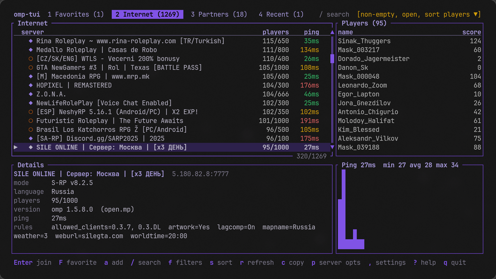

# open.mp Linux Launcher

open.mp launcher for Linux written in Rust with Ratatui.

Browse the open.mp server list in the terminal and join servers through Wine. The SA-MP and
open.mp client files are downloaded from open.mp automatically.



This was built to serve my personal need for having a browser on Arch. Beta tested by 2-3 people
who helped me battle harden it. If you find any issues, feel free to open an issue or a PR.

## Requirements

- Wine and winetricks
- GTA San Andreas 1.0 US installed in a Wine prefix

## Install

Download the binary from the [releases](https://github.com/DignitySAMP/open.mp-linux-launcher/releases) and run
`omp-tui --install-desktop`, or build it:

```
rustup target add i686-pc-windows-msvc   # for the embedded Windows helper, needs lld
cargo build --release
./target/release/omp-tui --install-desktop
```

## Usage

Run `omp-tui`. The first boot finds Wine and the game, downloads the client files and opens the
server list. `Enter` joins, `F` favorites, `/` searches, `,` opens settings, `?` lists all keys.

### Command line

Alternatively, you can join straight from a link:

```
omp-tui omp://1.2.3.4:7777
omp-tui samp://1.2.3.4:7777
```

You can launch the game directly without the UI by using the same flags as the original launcher:

```
omp-tui -h 1.2.3.4 -p 7777 -n Nick -g "/path/to/GTA San Andreas" -P password
```

> If the server does not require a password, you don't have to pass the optional -P flag.

### Other flags

| flag                           | what it does                                                |
| ------------------------------ | ----------------------------------------------------------- |
| `--wine PATH`, `--prefix PATH` | use another Wine or prefix for this run                     |
| `--samp-version 037R5`         | SA-MP client version (`037R1` .. `037R5`, `03DL`, `custom`) |
| `--check`                      | report on Wine, prefix, game exe and client files           |
| `--dump`                       | print the server list as JSON                               |
| `--install-desktop`            | install the binary, desktop entry and `omp://` handler      |

You can also use `--help` to see all flags, `--no-omp` to play without open.mp injected and `--version`.

### Files

| file                        | where                    |
| --------------------------- | ------------------------ |
| Settings                    | `~/.config/omp-tui`      |
| Favourites and client files | `~/.local/share/omp-tui` |
| Logging                     | `~/.local/state/omp-tui` |

> For debugging, you can change the logging state to debug to get detailed information. `OMPTUI_LOG=debug`.

## Notes

Not affiliated with the open.mp or SA-MP projects. AI was used for the injector and package
management.
